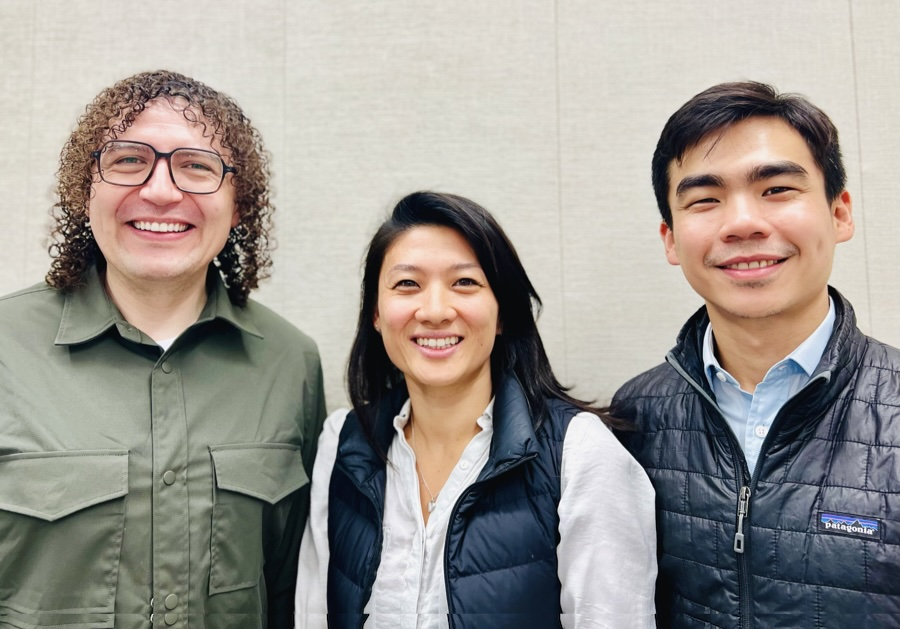

Chris Rod Max Show Official Website
==============
### Welcome to the website of our show!

The Chris Rod Max Show dives deep into the world of AI and its transformative impact on businesses and enterprises. Hosted by Chris, Rod and Max, the show features engaging discussions and insightful analysis of the latest developments, trends, and challenges in the rapidly evolving AI landscape.

Each episode, the trio explores a wide range of topics, from the adoption of generative AI in large organizations to the emergence of cutting-edge AI startups. They examine the potential benefits and risks associated with AI implementation, discussing real-world use cases, quick wins, and bold, transformative initiatives.

The show also features interviews with leading experts, innovators, and entrepreneurs in the AI space, providing listeners with unique perspectives and valuable insights from those at the forefront of this technological revolution.

Whether you're a business leader looking to harness the power of AI, a technology enthusiast eager to stay up-to-date with the latest breakthroughs, or simply curious about the future of work and innovation, The Chris Rod Max Show is your go-to resource. Tune in for thought-provoking discussions, actionable advice, and a glimpse into the exciting future that AI holds for businesses and society as a whole.

## Where to find us?

Watch our episodes on [YouTube](https://www.youtube.com/@chrisrodmax) or [Spotify](https://podcasters.spotify.com/pod/show/chrisrodmaxshow/). Listen to them on [Soundcloud](http://soundcloud.com/chrisrodmax). Don't forget to follow us on [X](https://x.com/ChrisRodMax) and [LinkedIn](https://www.linkedin.com/company/chrisrodmax/).

## About us

### Chris
Short-form for Christine :-) [Christine](https://www.linkedin.com/in/christinewang0/) is a business operator and entrepreneur with extensive experience in technology and innovation. She was the Managing Director of Lufthansa Innovation Hub, and held leadership roles at Meero China, a computer visioning start-up, Alibaba, BCG and BCG Digital Ventures. She has a background in business and computer science from the Technical University of Munich and an MBA from INSEAD. She is an avid drone photographer, ultrarunner and violinist in her free time.

### Rod
Short-form for Rodrigo :D [Rod](https://www.linkedin.com/in/aiengineer/) is a technical leader with experience in enterprise machine learning at Philip Morris, Samsung, and Rocket Internet, contributing to innovative AI projects at Alibaba and Huawei. As a professor at ITAM in Mexico and Ph.D. researcher specializing in Generative AI, Rod focuses on vector embeddings for multimodal data such as time series and event sequences in finance and supply chain applications. Rod compiles the largest collaborative database of AI tools at AI Product Engineer, an open community.

### Max
Short-form for Maxson. ;) [Max](https://www.linkedin.com/in/maxsontjy/) is a partnership and investment lead at a bank’s CVC unit with experience in the fintech and financial services sectors. Prior to this, he spent time advising senior leaders on strategic matters at Barclays and built the first DLT-based Syndicated Loan platform at Finastra. Max was a founding team member at AgriLedger, a DLT track-and-trace system that worked with The World Bank to serve small-holder farmers. When Max is not thinking about life, he enjoys physical exercises, learning something new, and a(many) game(s) of Catan.
